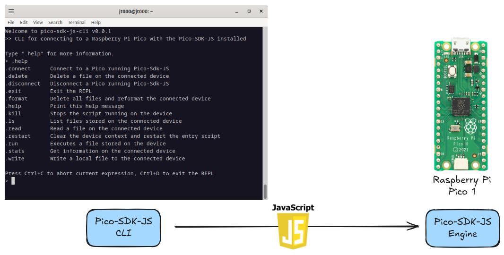

# Overview

Pico-SDK-JS is a powerful toolkit designed to run JavaScript seamlessly on the [Raspberry Pi Pico], making it easier than ever to develop and test applications for this microcontroller. With straightforward installation and a focus on developer ease, Pico-SDK-JS provides direct access to many of the [Pico-SDK] C functions within JavaScript, allowing users to leverage the extensive functionality of the Pico in a familiar, high-level language. This makes Pico-SDK-JS ideal for both hobbyists and professionals looking to streamline their development workflow on the Pico platform.

## Pico-SDK-JS Engine

The Pico-SDK-JS Engine component runs on your [Raspberry Pi Pico] to manage execution of your Javascript files. 

[Download .uf2 {{ site.data.downloads.engine.tag_name }}]({{ site.data.downloads.engine.assets[3].browser_download_url }}){: .btn .btn-blue}
[View Release Notes]({{ site.data.downloads.engine.html_url }}){: .btn .btn-blue}

See the [Installing Engine UF2] page for instructions on how to get the Engine installed on your Raspberry Pi Pico.

## Pico-SDK-JS CLI

This command line interface runs on your computer to upload files to your [Raspberry Pi Pico] and configure the Pico-SDK-JS.

[Install CLI](https://www.npmjs.com/package/pico-sdk-js-cli){: .btn .btn-blue}

[Raspberry Pi Pico]: https://www.raspberrypi.com/documentation/microcontrollers/pico-series.html
[Pico-SDK]: https://www.raspberrypi.com/documentation/pico-sdk/
[Installing Engine UF2]: docs/getting-started/install